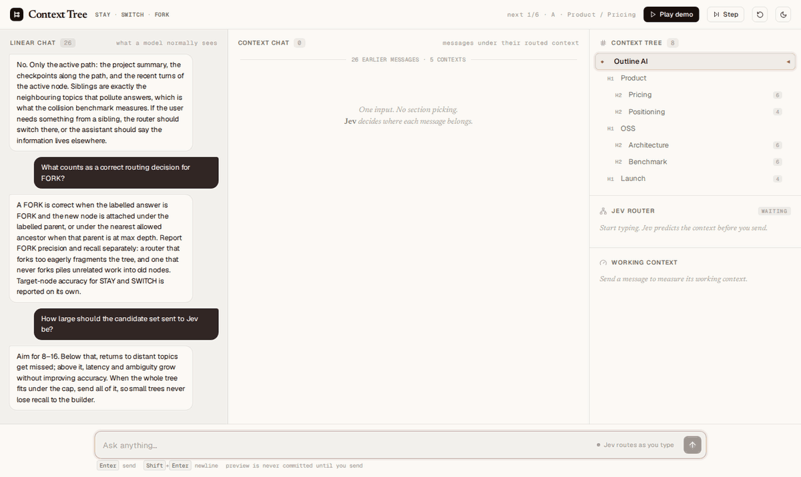

# Context Tree

A semantic context switcher for long-running LLM conversations.

Every message does one of three things:

**STAY** · **SWITCH** · **FORK**



<sub>Left: each message under the context Jev routed it to; returning to a topic continues its section. Right: real Jev's decision (`typesafe-ai/jev`, made while typing, before send), the estimated tokens sent against the full history, and the tree. Replies are scripted. Run it yourself with `pnpm dev` and open `?demo=true`, or add `&live=true` for live Claude replies.</sub>

## How it works

```
Message
   ↓
Candidate Builder      locality + recency + semantic top-k → 8–16 nodes
   ↓
Jev                    one bounded decision, with probabilities
   ↓
STAY / SWITCH / FORK
   ↓
Context Tree           active pointer moves; FORK adds a node
   ↓
Working Context        root checkpoint + active path + active checkpoint + recent turns
   ↓
LLM
```

Jev decides **where**. The LLM decides **what to say**.

Jev can also route a draft while you type (preview) without committing anything. The active context changes only when you send.

## Quick start

```bash
pnpm install
pnpm dev            # demo at http://localhost:5173/?demo=true
pnpm example        # minimal SDK example in the terminal
pnpm test
pnpm bench          # regenerates benchmarks/results/RESULTS.md
```

Requires Node 20+ and pnpm. No API keys needed: without keys, the demo, tests and benchmarks run locally and deterministically on Jev's local reference backend.

### Live mode (optional)

```bash
cp .env.example .env.local   # add AI_GATEWAY_API_KEY and/or ANTHROPIC_API_KEY
pnpm jev:check               # one live Jev call, printed verbatim
pnpm dev                     # the header shows JEV · typesafe-ai/jev and LLM · <model>
```

| Key | Enables |
| --- | --- |
| `AI_GATEWAY_API_KEY` | real Jev ([`typesafe-ai/jev`](https://vercel.com/ai-gateway/models) on the Vercel AI Gateway) for routing in the demo, `pnpm jev:check`, `pnpm bench:jev` |
| `ANTHROPIC_API_KEY` | live Claude replies in free-chat mode (`?demo=true&live=true` for the scripted demo too) with measured input, cache and TTFT in the inspector; `pnpm bench:llm` |

Keys stay in the Vite dev server (`apps/demo/server/api.ts`); the browser never sees them. A typing-time preview that matches the sent text is reused on send, so each message costs one Jev call.

```ts
import { createContextTree } from '@context-tree/core';
import { JevRouter } from '@context-tree/jev';
import { GatewayJevBackend } from '@context-tree/jev/gateway'; // server-side

const tree = createContextTree({
  router: new JevRouter({ backend: new GatewayJevBackend() }), // omit backend for the local reference scorer
  root: 'My project',
});

const result = await tree.add({ role: 'user', content: 'Back to pricing — should Pro be $15 or $20?' });

result.decision;   // e.g. { action: 'switch', targetNodeId: '…', confidence: 0.97, candidateScores: [...], latencyMs: 1.9 }
result.activePath; // ['Product', 'Pricing']
result.context;    // { system, messages, checkpoint, recentMessages, tokens: { total, stablePrefix, delta, current } }

// Send result.context.system + result.context.messages to your model, then:
await tree.add({ role: 'assistant', content: reply });
```

Other entry points:

- `tree.preview(draft)`: route without committing (typing-time preview)
- `tree.toJSON()` / `createContextTree({ router, initial })`: serialize and restore
- `tree.createNode(...)`, `tree.record(...)`, `tree.activate(...)`: seed or import a tree

See [`examples/basic`](examples/basic/index.ts) for a complete runnable script.

## Why it matters

- **Less irrelevant history.** The model sees the active branch, not every topic you touched.
- **Topic continuity.** Returning to an old topic restores its context, not a keyword search over it.
- **Smaller, cache-friendly prompts.** The working context stays roughly constant as history grows, and its prefix only changes when you switch.
- **Human-readable state.** The same tree is navigation for the user and context state for the machine.

## Benchmarks

Measured on seeded, reproducible datasets. Full tables, per-case JSON and methodology: [`benchmarks/results/RESULTS.md`](benchmarks/results/RESULTS.md) and [`docs/benchmarks.md`](docs/benchmarks.md).

### Real answers (Claude Opus 5, `pnpm bench:llm`)

Same model, same prompt template, same questions; only the context strategy differs. Accuracy is over answered requests (refusals are listed separately below).

| Strategy | Topic return: correct | Collision: correct | Mean input tokens (A / B) |
| --- | --- | --- | --- |
| Recent window (12 msgs) | 0% (0/8) | 0% (0/8) | 1,093 / 903 |
| Full history | 100% (5/5) | 100% (7/7) | 4,290 / 2,603 |
| Vector retrieval (top-8 + last 4) | 100% (5/5) | 88% (7/8) | 787 / 894 |
| Context Tree + Jev, local backend | 100% (7/7) | 75% (6/8) | 1,031 / 727 |
| **Context Tree + real Jev** (`typesafe-ai/jev`) | **88% (7/8)** | **100% (8/8)** | **923 / 710** |
| Context Tree, oracle routing | 100% (8/8) | 100% (8/8) | 1,030 / 705 |

Input tokens are as reported by the API. Both Jev rows route every user message from an empty tree: 384 routing calls each, 0 fallbacks for real Jev. One run per strategy.

### Context size, scaling and cache cost (`pnpm bench`)

| Strategy | Input tokens at 173K history | Input cost, `ABCDEFGABCDEFG` switching (simulated cache) |
| --- | --- | --- |
| Recent window (12 msgs) | 853 (fact missing) | $0.0436 |
| Full history | 173,034 | $0.0568 |
| Vector retrieval (top-8 + last 4) | 414 | $0.0382 |
| **Context Tree + Jev** | **516** | **$0.0350** |
| Context Tree, oracle routing | 512 | $0.0355 |

Routing (57 hand-labelled cases):

| Router | Target acc (strict / lenient) | STAY | SWITCH | FORK precision / recall | Latency p50 |
| --- | --- | --- | --- | --- | --- |
| Lexical baseline | 70% / 70% | 64% | 92% | 45% / 50% | <1 ms (in-process) |
| Jev, local reference backend | 89% / 91% | 100% | 88% | 100% / 80% | <1 ms (in-process) |
| **Real Jev** (`typesafe-ai/jev`, `pnpm bench:jev`) | **89% / 93%** | 100% | 92% | 100% / 60% | 324 ms (gateway round trip) |
| OpenAI Decisions (`gpt-6-luna`, `JEV_BACKEND=openai pnpm bench:jev`) | 82% / 88% | 95% | 92% | 100% / 30% | 128 ms (API round trip) |

Real Jev: 57 calls, 0 fallbacks, 1,470 input tokens per call as reported by the gateway. OpenAI Decisions is asked the same two questions with the same wording: 57 calls, 0 fallbacks, 968 input tokens per call; two runs gave the same 10 misses.

**Calibration (`pnpm bench:calibrate`, in-sample).** Both routers under-fork. Replaying recorded responses with the fork probability multiplied by a constant: real Jev reaches 96% strict / 100% lenient with FORK precision and recall both 100% for any multiplier from 16 to 64; OpenAI Decisions peaks at 88%. A reworded route question (`v2`) also raises FORK recall but over-forks unless damped (Jev 95%, OpenAI 91% at best). These settings were chosen on the same 57 cases they are scored on.

**Held-out check (`ROUTING_SET=holdout pnpm bench:calibrate`).** 44 new cases in two new domains, committed before any router ran on them. Most new topics there are unannounced, and 8 cases are new angles inside the active topic that should stay. The pre-registered test was real Jev with fork ×16: adopt it only if strict accuracy does not drop and FORK precision stays at or above 90%.

| Real Jev, prompt v1 | Strict / lenient | STAY | FORK precision / recall |
| --- | --- | --- | --- |
| fork ×1 (default) | 80% / 84% | 100% | 100% / 43% |
| fork ×16 (pre-registered) | 89% / 95% | 89% | 86% / 86% |

Accuracy rose by 9 points and none of the 8 near-miss cases forked. But FORK precision of 86% misses the pre-registered bar, so ×16 is not adopted. Of the two extra forks, one is acceptable under the lenient labels (ha3); the other opened a new node for "How are we doing overall?" (ha4). The reworded `v2` prompt over-forks on these cases (Jev STAY 72%), so it is dropped. OpenAI Decisions improves from 70% to 80% with ×16. The held-out baseline for real Jev was 77% in a separate run, against 80% here, so real Jev is not fully deterministic on this set. Full results: [`routing-calibration.md`](benchmarks/results/routing-calibration.md), [`routing-calibration-holdout.md`](benchmarks/results/routing-calibration-holdout.md).

### What this shows, and what it does not

- **Same answers, much less context.** Wherever the right context was selected, Opus 5 answered correctly. Context Tree reaches that with about a quarter of full history's input on topic return, and its working context stays flat as history grows (~500 estimated tokens at 173K).
- **Collisions rarely fooled Opus 5 at this scale.** Full history puts every conflicting "we decided the database is…" line into context (the context-level check in `RESULTS.md` flags 100% of them), yet answered 7/7. Vector retrieval's one flagged answer (B5) named the right value and also listed the other projects' values, which the strict grader counts as using a colliding fact; in the previous run it scored 8/8. The benefit of a clean context here is mainly size, not accuracy. Harder collisions or weaker models may differ; that is untested.
- **Routing is the bottleneck.** Every Context Tree miss is a routing error; with oracle routing the tree scores 100% with the fewest tokens. The local backend's two collision misses (B1, B3) routed the question to another project's node, so Opus answered about that project. Real Jev's one miss (A1) was a wrong FORK: it opened a new node for the question (Project Atlas Billing → Project Atlas Database) instead of routing to the node that held the answer, so the model saw 119 tokens and said it did not know. On the other 15 cases real Jev matched oracle routing.
- **Real Jev matches the local backend, on held-out fixtures.** Real `typesafe-ai/jev` was never tuned on the routing fixtures and scores 89% strict, the same as the local backend. The local backend's 89% is a development score: it was iterated on while those fixtures were visible. The two routers miss different cases. Real Jev gets every return right (8/8) but under-forks: in 4 of 10 new-topic cases it stays in or switches to an existing node instead of opening a new one. Three full runs gave identical scores and the same 6 misses, with 0 fallbacks. With 57 cases, one case is about 1.8 points, and with 16 answer cases one case is 6 points, so neither benchmark shows that either router is better.
- **Refusals.** 8 of 96 requests returned `stop_reason: "refusal"`, all in cases A6–A8 and B7 across three strategies (none for either Jev row or oracle routing), which points at the synthetic text rather than the strategy. Refusal fallbacks were off so every answer comes from the same model. They are excluded from accuracy and listed in `RESULTS.md`.
- **Measured in the demo.** In live mode, returning to Product / Pricing after two other topics read 563 of 743 input tokens from the prompt cache (Opus 5, 2.8 s TTFT).
- Token counts in the second table are estimates (≈4 characters per token); the real tokenizer counted about 1.3× more on demo text. Cache costs there are simulated from Anthropic's documented caching rules. The conversations are synthetic.

## Architecture

```
context-tree/
├── packages/core     @context-tree/core   tree, active pointer, candidates, routing interfaces,
│                                          working context, checkpoints, serialization
├── packages/jev      @context-tree/jev    JevRouter, Jev protocol, HTTP + local backends
├── apps/demo         interactive demo (React + Vite)
├── examples/basic    minimal SDK usage
├── benchmarks        datasets, strategies, runners, results
└── docs              architecture, Jev protocol, benchmark methodology, Outline AI audit
```

- **`@context-tree/core` is model-agnostic.** It knows nothing about React, Jev, providers, databases or auth. Routers, candidate builders, embedders, titlers and summarizers are interfaces.
- **`@context-tree/jev`** turns candidates into a `jev.route.v0` request and the response into a decision, with a timeout and a fallback router. `HttpJevBackend` calls a hosted Jev model. `LocalJevBackend` is a deterministic in-process reference scorer, so everything runs without a network.
- **Working context** is built cache-first: stable global prefix → root checkpoint → active path → active checkpoint → append-only recent turns → current message. Checkpoints are versioned and only re-folded when a node's delta passes a threshold, never on every turn.
- **Depth is capped** (`maxDepth`, default 3 below the root). A FORK that would go deeper attaches to the nearest allowed ancestor.

More in [`docs/architecture.md`](docs/architecture.md) and [`docs/jev-protocol.md`](docs/jev-protocol.md). The demo's visual language comes from Outline AI; see [`docs/outline-ai-reference-audit.md`](docs/outline-ai-reference-audit.md).

## Status

Stage 1: an open-source primitive and demo. There is no hosted service, accounts or billing, and none are planned for this repository.

## License

MIT
